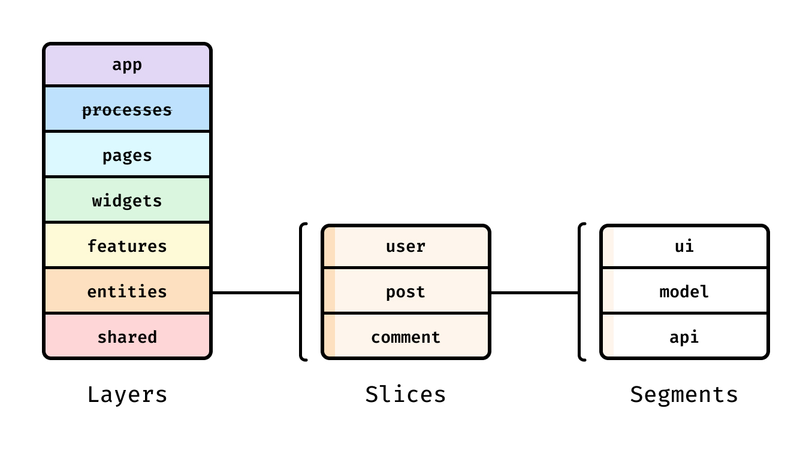
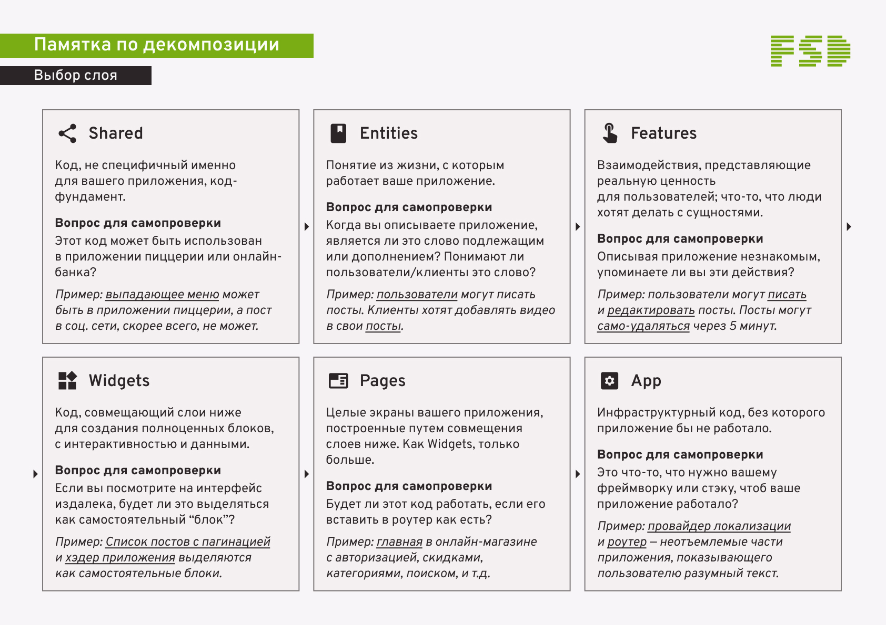
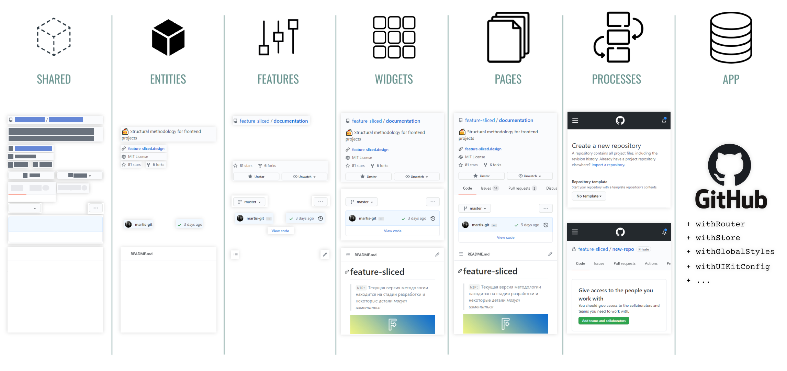

## Архитектура

[Features sliced design](https://feature-sliced.design/ru/) 

[Пример слоев](https://feature-sliced.design/ru/docs/reference/layers#entities)

Проект на FSD состоит из слоев (layers), каждый слой состоит из слайсов (slices) и каждый слайс состоит из сегментов (segments).

Слои стандартизированы во всех проектах и расположены вертикально. Модули на одном слое могут взаимодействовать лишь с модулями, находящимися на слоях строго ниже. На данный момент слоев семь (снизу вверх):

* shared — переиспользуемый код, не имеющий отношения к специфике приложения/бизнеса.(например, UIKit, libs, API)
* entities (сущности) — бизнес-сущности.(например, User, Product, Order)
* features (фичи) — взаимодействия с пользователем, действия, которые несут бизнес-ценность для пользователя.(например, SendComment, AddToCart, UsersSearch)
* widgets (виджеты) — композиционный слой для соединения сущностей и фич в самостоятельные блоки(например, IssuesList, UserProfile).
* pages (страницы) — композиционный слой для сборки полноценных страниц из сущностей, фич и виджетов.
* app — настройки, стили и провайдеры для всего приложения.

