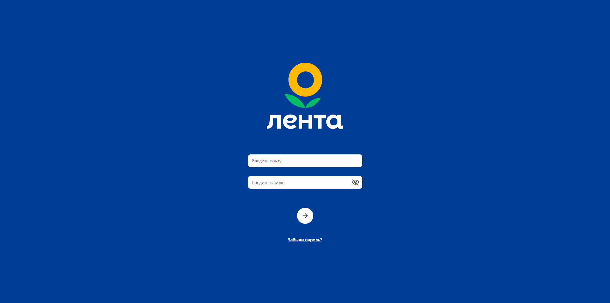
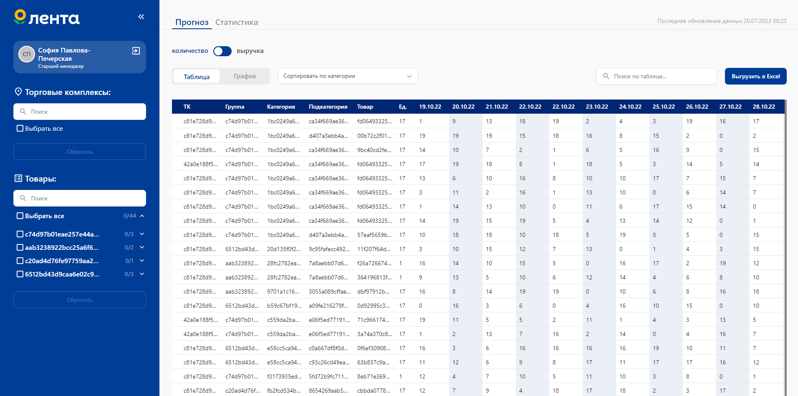
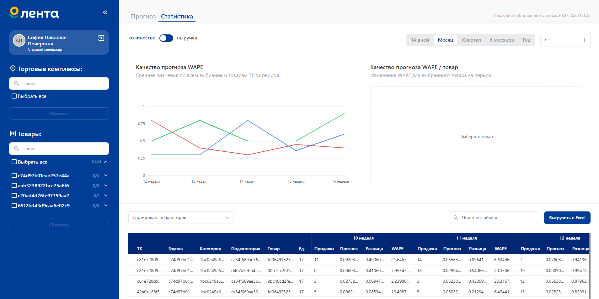
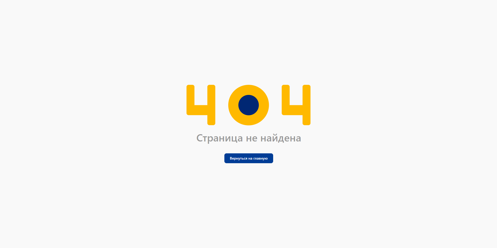
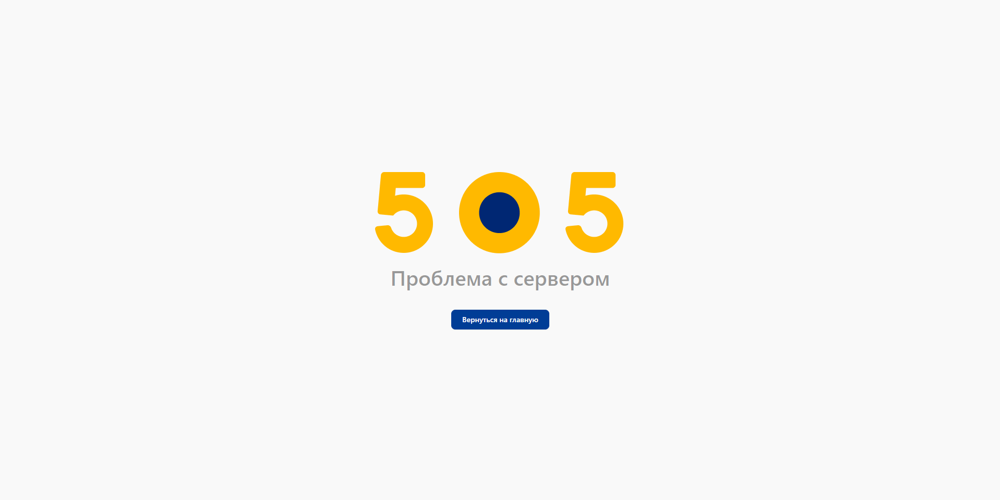
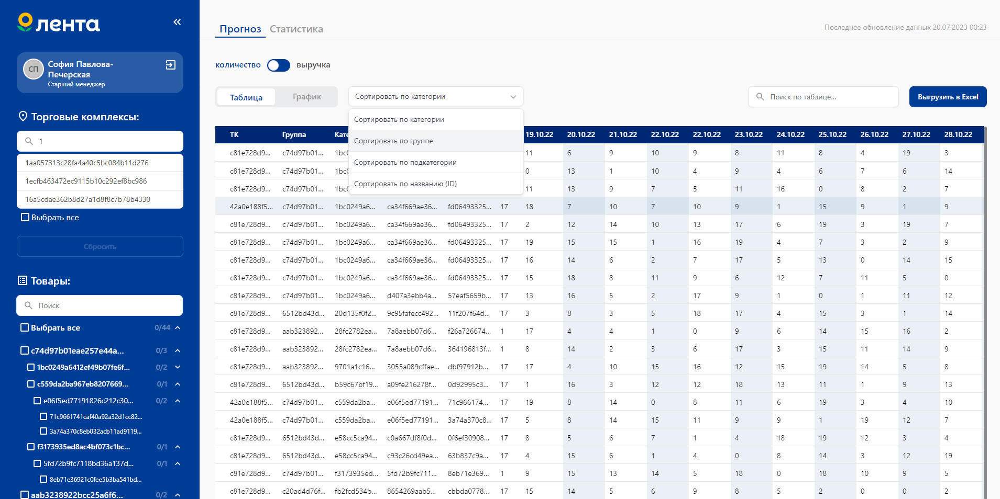
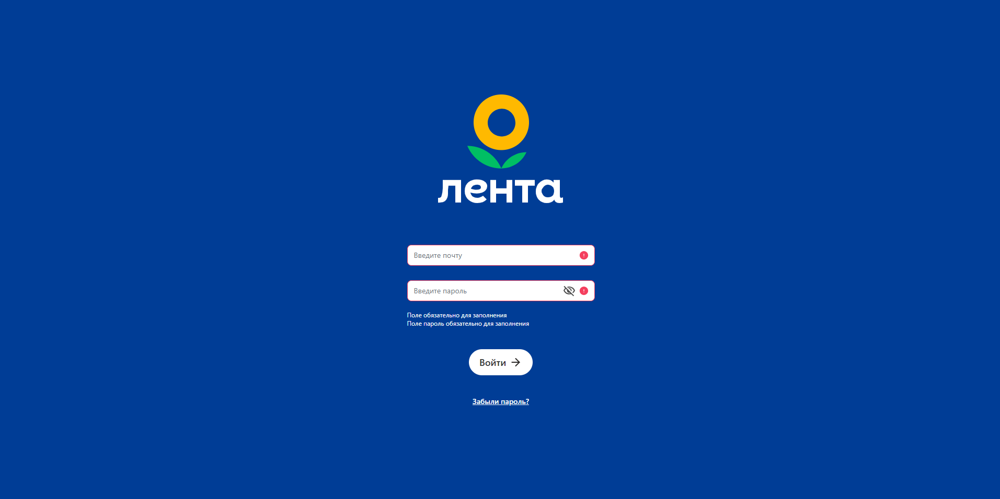
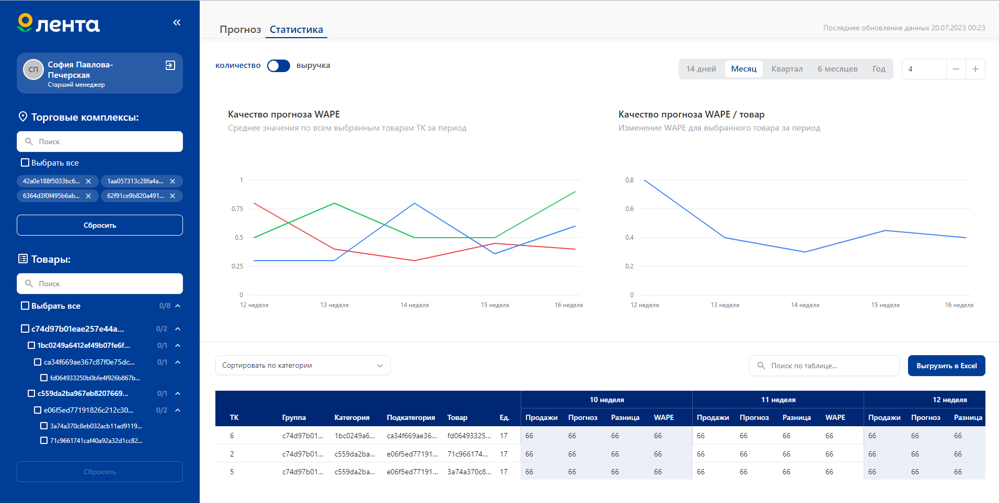

## Десктоп, исходный вид:  

### Авторизация:

### Основной экран:  
- Прогноз  

  

- Статистика

  

### Ошибки:
- 404

  

- 500

 

## Десктоп, раскрываемые области

 

## Десктоп, максимальный контент

### Авторизация:

 

### Основной экран:

 

